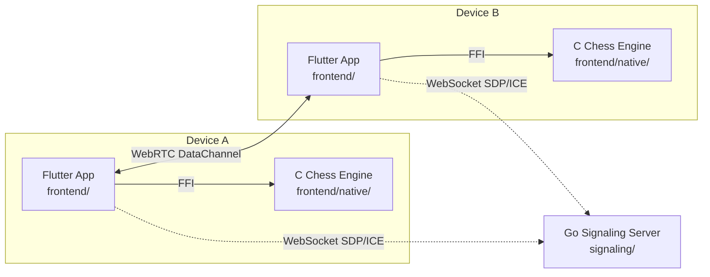

# 🏛 Architecture: chessrecast

## 1. System context

chessrecast is a Flutter app embedding a native C chess engine. Two players connect directly via WebRTC; a lightweight Go signaling server brokers the initial connection only.

After the WebRTC handshake completes, the signaling server plays no further role — all game moves travel over the peer data channel.

## 2. Top-level components

| Component | Path | Responsibility |
|---|---|---|
| Flutter app | `frontend/lib/` | UI, game loop, P2P session management, FFI bridge |
| Native C engine | `frontend/native/` | Move generation, position evaluation, mod eval hooks |
| Go signaling server | `signaling/` | WebSocket hub, SDP/ICE relay only — stateless per-game |
| Bot improvement loop | `bots/` | Audit queue, baselines, opening CSVs, mod reports |
| Ops scripts | `xops/` | Make dispatchers, tracking append, session bootstrap |

## 3. Data flow

### Single-player move

1. User taps a square → `frontend/lib/game/` computes legal moves via `libchess_engine.so` (FFI call).
2. User selects a move → engine applies it, returns new position as a FEN string.
3. UI re-renders from the new FEN.

### P2P move

1. Local player makes a move → encoded as a `MoveFrame` (CBOR) and sent over the WebRTC data channel.
2. Remote peer receives `MoveFrame` → validates via local engine FFI → applies → re-renders.
3. Both sides maintain identical position state; the engine is the source of truth for legality.

### Signaling handshake

1. Player A opens a WebSocket to `signaling/` and creates a room.
2. Player B joins the room. Server relays SDP offer/answer and ICE candidates.
3. Once the DTLS handshake completes, both sides close the signaling WebSocket.

## 4. Cross-cutting concerns

- **Auth**: None. Rooms use short-lived tokens derived from a KDF (`bots/baselines/p2p_identity.json` documents the scheme). No user identity stored server-side.
- **Logging**: Structured JSON to stdout in Go; Dart `developer.log` (non-PII) in Flutter. Runtime telemetry in `bots/reports/_runtime/`.
- **Errors**: FFI errors panic-safe (C returns error codes; Dart throws typed exceptions). P2P errors: connection errors trigger reconnect; game errors revert the local move.
- **Config**: signaling server port/origin via env vars (`SIGNALING_PORT`, `SIGNALING_ORIGIN`). Engine params compile-time constants in `frontend/native/engine/`.

## 5. Invariants you must not break

- **All game state lives in the engine.** Never derive legal moves or check/checkmate state in Dart; always call through FFI.
- **Mod eval files are isolated.** `eval_<mod>.c` is the only file that changes per mod. Shared engine files (`move_generator.c`, `board.c`) must not contain mod-specific logic.
- **The fixed opening slice (`bots/openings/<mod>.csv`) is stable.** Changing it invalidates all prior baselines; requires a `kind: corpus_curation` queue entry and immediate baseline refresh.
- **Signaling server is stateless.** Rooms are in-memory only; no DB, no filesystem writes. Game logic never runs server-side.
- **WebRTC data channel is the only transport.** Never fall back to relaying moves through the signaling server.

## 6. Deployment topology

- **Dev**: `flutter run` for the app; `cd signaling && go run ./cmd/server` for local signaling (defaults to `:8080`).
- **Prod signaling**: Docker image (`signaling/Dockerfile`) deployed behind a TLS-terminating reverse proxy. See `docs/p2p/P2P_OPERATIONS.md`.
- **Engine build**: `cd frontend && flutter build <platform>` compiles the C engine via CMake; the resulting shared library is bundled into the app package.
- **Bot loop**: runs locally; no server needed. Start with `/improve-mod` in VS Code Copilot Chat (Agent mode).

## 7. Out of scope

- The C engine is not a full-strength chess AI — it evaluates positions for audit purposes. It does not play as an opponent.
- The signaling server does not persist rooms across restarts; reconnect must re-signal.
- Web builds use WASM for the engine; the Dart FFI layer automatically switches between `.so` and WASM builds.
